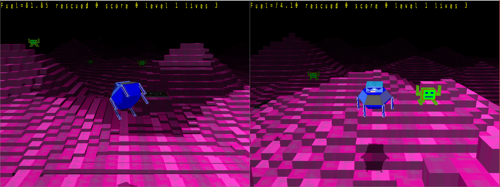

# Rust Invaders

# TO DO

Then it is loading  screen but perhaps in javascript for a change.

--------------------------------------


A 3d rust game using OpenGl and Emscripten to build for the wasm32-unknown-emscripten.
It can also run standalone



standalone
```
cargo build
cargo run
```

For web deployment
```
cargo build --target=wasm32-unknown-emscripten 
```

To try web locally
```
./run_wasm.sh
```

to run the release you'll need to deploy in a webserver, e.g.
```
python3 -m http.server 8000
```